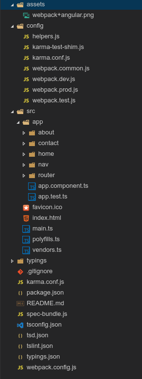

[](https://badge.fury.io/gh/blinfo%2Fangular2-webpack-seed)
[](https://david-dm.org/angularclass/angular2-webpack-starter)

#Angular2 Webpack Seed 


# Technologies
 1. Npm
 2. webpack
 3. webpack-dev-server
 4. bootstrap
 5. angular2-materual
 6. typescript
 7. karma
 8. jasmine
 9. code-coverage
 10. Typings
 

#File Structure 


```bash
# clone repo
git clone  https://github.com/blinfo/angular2-webpack-seed.git

# change directory to our repo
cd angular2-webpack-seed

# install the repo with npm
npm install

# validate the repo with tslint and test
npm run validate

# run test 
npm test

# build the repo
npm run build

# start the server
npm start

```

```bash
list of all scripts
"scripts": {
    "validate": "npm-run-all --parallel validate-webpack:* lint test",
    "validate-webpack:dev": "webpack-validator webpack.config.js --env.dev",
    "validate-webpack:prod": "webpack-validator webpack.config.js --env.prod",
    "start": "webpack-dev-server  --hot  --history-api-fallback --env.dev",
    "serve:prod": "webpack-dev-server  --hot  --history-api-fallback --env.prod",
    "build": "rimraf dist && webpack --config config/webpack.prod.js --progress --profile --bail",
    "test": "karma start",
    "watch:test": "npm test -- --auto-watch --no-single-run",
    "clean-dist": "rimraf dist",
    "copy-files": "cpy \"**/index.html\" favicon.ico app/home/homm-data.json \"../dist\" --cwd=src --parents",
    "clean-and-copy": "npm run clean-dist && npm run copy-files",
    "prebuild": "npm run clean-and-copy",
    "prebuild:prod": "npm run clean-and-copy",
    "build:prod": "webpack --env.prod",
    "lint": "tslint -c tslint.json src/**/*.ts",
    "postinstall": "typings install",
    "coverage": "http-server -c-1 -o -p 9875 ./coverage"
  }
```
```bash
for validating before commiting to git
  "config": {
    "ghooks": {
      "pre-commit": "npm run validate"
    }
  }
```

 